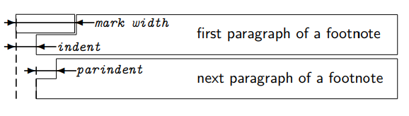

### Defined LaTeX Class:

First thing a class or package file does:
```
\NeedsTeXFormat{LaTeX2e}
\ProvidesPackage{<package>}[<date> <other info>]
```

```
\NeedsTeXFormat{LaTeX2e}
\ProvidesClass{<class>}[<date> <other info>]
```

Eg.
```
\NeedsTeXFormat{LaTeX2e}
\ProvidesClass{myclass}[2017/10/12 v1.0 Dmidma Defined Class]
```

To use packages or classes inside other packages or classes:
```
\LoadClass \LoadClassWithOptions
\RequirePackage \RequirePackageWithOptions
```


### scrartcl class:

This class provides __article__ like emement of the __Koma-script__ collection.

```
\LoadClass[10pt]{scrartcl}
```
* `[10pt]` - setting the default font to 10pt.


* To remove the numbers of the sections:
```
\setcounter{secnumdepth}{-1}
```


> one of the important packages is `geometry`
```
\RequirePackage[hmargin=1.25cm,vmargin=1.25cm,twocolumn,columnsep=1.25cm]{geometry}
```

* Calling `\twocolumn` before the text that will be splitted into two columns.
* Calling `\onecolum` will make the text go back to one column.


* To remove the header and footer from page:
```
\pagestyle{empty}
```

> You can specify it only for the current page with `\thispagestyle{empty}`

* To resize the length of parindent:
```
\setlength\parindent{0pt}
```



> `\textit{text}` - Italic text.

---

> Use package `flowfram`.


`\newflowframe[<pages>]{<width>}{<height>}{<x>}{<y>}[<label>]`

Eg.
```
\newflowframe[1-5]
{0.60\textwidth}{\textheight}
{0pt}{0pt}[leftcolumn]

\newflowframe[1-5]{0.30\textwidth}{\textheight}
{0.65\textwidth}{0pt}[rightcolumn]
```

It is used for more control on the columns.

---

> Use package `tabularx`.

To make an array:
```
\beign{tabularx}{<width>}{<preamble>}

element & element & element & element \\
element & element & element & element \\
element & element & element & element \\

\end{tabularx}
```

* _preamble_ describes the outline of the table:
    - `{ |c|c|c| }`
    - `{ c|c|c }`
    - `{ ||c c c c||}`
    - `{ | m{5em} | m{1cm} | m{1cm} | }`
    - `{ | X[l] | X[c] | X[r] | }`


> __c__ means column but also centered. It also wrap up the length of column to the content.
> __X__ means auto calculate the width of columns. The parameters inside [] stand for _left_, _center_ and _right_.

* Use a `\hline` after the `\begin` and before `\end` to make horizontal lines.


---

> Use package `xcolor`.

* To set background and foreground colors:
```
\pagecolor[HTML]{RRGGBB}
\color[HTML]{RRGGBB}
```

* To define a color:
```
\definecolor{name}{HTML}{RRGGBB}
```

---

> Use package `hyperref`

```
\hypersetup{colorlinks,breaklinks,urlcolor=name,linkcolor=name}
```

    - colorlinks: allow to color links (else =false)
    - breaklinks: wrap up links when they are too long
    - urlcolor: external links
    - linkcolor: internal links

---

* The two commands `\setkomafont` and `\addtokomafont` are used to change the characteristics of a given _element_.

```
\setkomafont{disposition}{\color[HTML]{801010}}
\setkomafont{section}{\scshape\Large\mdseries}
```
* disposition is related to its following section.  
It contains font family, and its color.


---

#### Defining Commands:

    - `\newcommand`: Defines a new command and makes an error if it is already defined.
    - `\renewcommand`: Redefines a predefined command, and makes an error if it is not yet defined.
    - `\providecommand`: defines a new command if it isn't already defined.


```
\renewcommand\part[1]{%
    \twocolumn[%
    \begin{center}
    \vskip-\lastskip%
    {\usekomafont{part} #1} \medskip\\
    {\fontfamily{pzc}\selectfont\Huge Curriculum vitae}
    \bigskip
    \end{center}]}

```

* `\usekomafont{element}` uses the current font style of the selected element.

> You can combine `usekomafont` of some element in `setkomafont` of other element.


---

The @ character has a __catcode__ (category code) of 12, which means it is not treated as a normal letter.

In LaTeX class and package files, it is treated as a normal letter (catcode 11) and this allows packages to make macro-names with @.  
The advantage of this is such macro names are automatically protected from regular users.

Using:
```
\makeatletter
% code here
\makeatother
```
will change the catcode of @ from 12 to 11 and 11 to 12, respectively.

---


